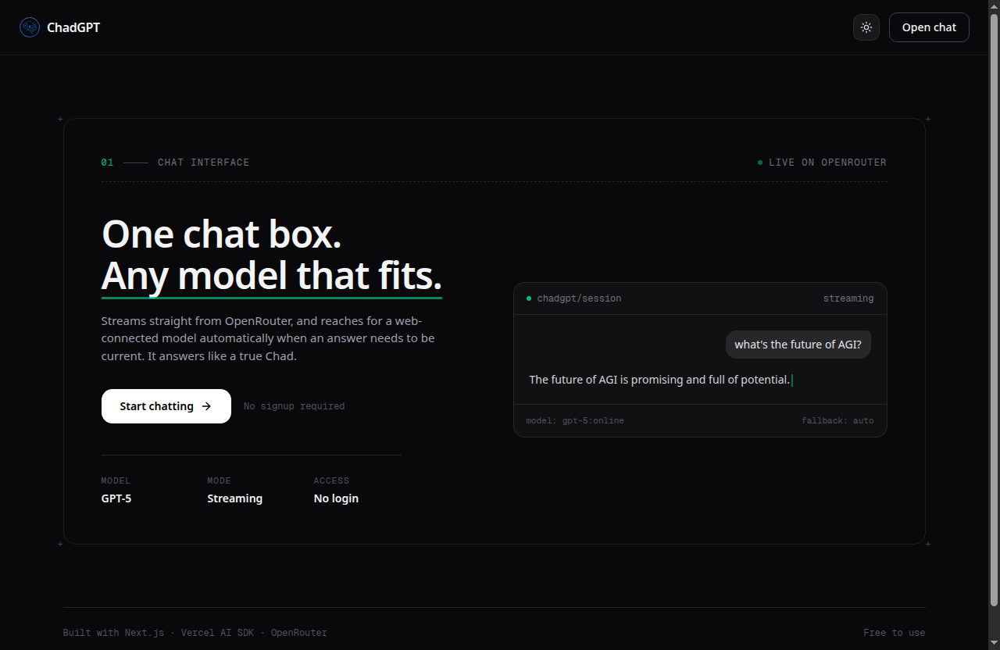
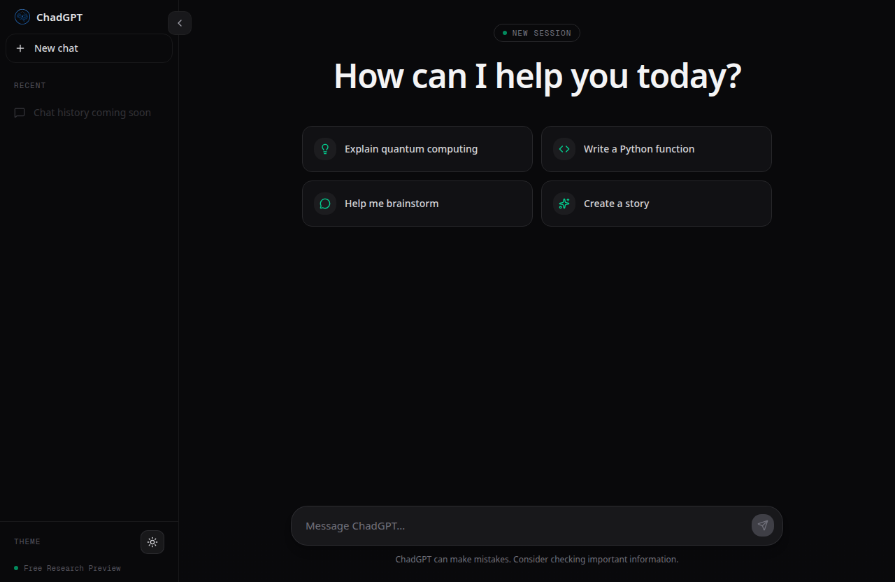

<div align="center">
  

  # ChadGPT

  A minimal, streaming chat interface for OpenRouter's models — built on Next.js and the Vercel AI SDK.

  [](./LICENSE)
  [](https://nextjs.org)
  [](https://www.typescriptlang.org)
  [](#contributing)
</div>

<br />

<p align="center">
  
  
</p>

## Overview

ChadGPT is a lightweight, self-hostable chat UI that streams responses from any model available on [OpenRouter](https://openrouter.ai). It automatically detects when a question needs current/real-time information and routes that request to a web-connected model — otherwise it uses the standard model for a faster, cheaper response.

No accounts, no database, no vendor lock-in beyond your own OpenRouter API key.

## Features

- **Live token streaming** — responses render as they're generated, not after the fact
- **Automatic online routing** — recency-sensitive questions ("what's the latest...", "today's...") are detected upfront and routed to a web-connected model; everything else uses the faster base model
- **Markdown rendering** — assistant responses render through `react-markdown` with Tailwind Typography
- **Light/dark theming** — via `next-themes`, no flash-of-wrong-theme on load
- **Zero backend infrastructure** — a single Next.js API route is the only server-side component; no database, no auth server, no queues
- **Fully typed** — TypeScript throughout, strict mode on

## Tech Stack

| Layer | Technology |
|---|---|
| Framework | [Next.js 15](https://nextjs.org) (App Router, Turbopack) |
| UI | React 19, Tailwind CSS v4, [shadcn/ui](https://ui.shadcn.com) conventions |
| AI integration | [Vercel AI SDK](https://sdk.vercel.ai) (`ai`, `@ai-sdk/react`) |
| Model provider | [OpenRouter](https://openrouter.ai) via `@openrouter/ai-sdk-provider` |
| Icons | [lucide-react](https://lucide.dev) |
| Markdown | `react-markdown` + `@tailwindcss/typography` |
| Language | TypeScript |
| Package manager | [pnpm](https://pnpm.io) |

## Architecture

```
Browser (useChat)
   │  POST /api/chat  { messages }
   ▼
app/api/chat/route.ts
   │  needsLiveData(query) → pick MODELS.BASE or MODELS.ONLINE
   ▼
lib/openrouter.ts  (streamText via @openrouter/ai-sdk-provider)
   ▼
OpenRouter API  →  underlying LLM provider
   │  tokens stream back over SSE, unbuffered
   ▼
useChat() parses the stream live → UI updates token-by-token
```

There is exactly one server-side integration point with OpenRouter: `app/api/chat/route.ts`. Model selection lives in `lib/openrouter.ts`; recency detection lives in `lib/responseAnalyzer.ts`. See [`.claude/CLAUDE.md`](.claude/CLAUDE.md) for the full architectural rationale behind these decisions.

## Getting Started

### Prerequisites

- Node.js ≥ 20
- [pnpm](https://pnpm.io) ≥ 9
- An [OpenRouter](https://openrouter.ai/keys) API key

### Setup

```bash
git clone https://github.com/HarshGupta-2002/chadgpt.git
cd chadgpt
pnpm install
```

Create a `.env` file in the project root:

```bash
OPENROUTER_API_KEY=your-openrouter-api-key
OPENROUTER_MAX_OUTPUT_TOKENS=1000
```

For a local key that differs from your production one, add it instead to `.env.local` — Next.js loads it with higher precedence, and both files are gitignored.

### Run

```bash
pnpm dev
```

Open [http://localhost:3000](http://localhost:3000).

## Available Scripts

| Command | Description |
|---|---|
| `pnpm dev` | Start the dev server (Turbopack) |
| `pnpm build` | Production build |
| `pnpm start` | Run the production build |
| `pnpm lint` | Run ESLint |

## Environment Variables

| Variable | Required | Description |
|---|---|---|
| `OPENROUTER_API_KEY` | Yes | Your OpenRouter API key |
| `OPENROUTER_MAX_OUTPUT_TOKENS` | No | Max tokens per response (default: `1000`) |

## Project Structure

```
app/
├── api/chat/route.ts    # Only server-side OpenRouter integration point
├── chat/page.tsx         # Chat UI (client component, useChat)
├── page.tsx              # Landing page
└── layout.tsx            # Root layout, theme provider

components/
├── chat/                 # Sidebar, ChatMessage, ChatInput, EmptyState
├── ThemeProvider.tsx
└── ThemeToggle.tsx

lib/
├── openrouter.ts         # Model config, streamText wrapper
├── responseAnalyzer.ts   # Recency-intent detection
└── utils.ts

styles/globals.css        # Tailwind v4 + theme tokens
```

## Contributing

Contributions are welcome — bug fixes, features, docs, or design polish.

1. **Fork** the repo and create a branch off `main`: `git checkout -b feat/your-feature`
2. **Install and run locally** following [Getting Started](#getting-started)
3. **Match the existing style**: comments capped at 2 lines, TypeScript strict mode must pass, run `pnpm lint` before committing
4. **Commit clearly** — describe *what* changed and *why*, not just *what*
5. **Open a pull request** against `main` with a description of the change and, for UI changes, a before/after screenshot

If you're planning a larger change, please open an issue first to discuss the approach before investing significant time.

### Reporting bugs

Open an issue with: what you expected, what happened instead, and steps to reproduce. Include console/server errors verbatim where relevant.

## License

[MIT](./LICENSE) © Harsh Gupta
